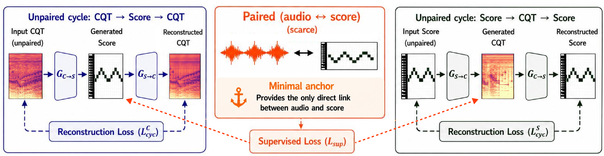

# Music Transcription with (Almost) No Supervision

[](https://arxiv.org/abs/2605.24193)

**Official implementation** of the paper:

> **Music Transcription with (Almost) No Supervision**  
> Saebyeol Shin, Chao Wan, Zhenzhen Liu, Justin Lovelace, Daniel C. Lin, Kilian Q. Weinberger, John Thickstun  
> Cornell University  
> *Preprint*



We adopt a cycle-consistent translation framework in which a small amount of paired audio–score data acts as a minimal anchor, unlocking the full potential of unpaired recordings and symbolic scores for automatic music transcription.

---

## Installation

```bash
# Install PyTorch with the CUDA version matching your system, e.g.:
pip install torch --index-url https://download.pytorch.org/whl/cu128

# Install remaining dependencies
pip install -r requirements.txt
```

Tested with Python 3.10, PyTorch 2.10.0+cu128, bf16-mixed precision.

---

## Repository Structure

```
.
├── train_piano_vae.py        # Step 1: Train MIDI-VAE (piano)
├── train_piano.py            # Step 2: Train cycle-consistent model (piano, MAESTRO)
├── train_musicnet_vae.py     # Step 1: Train multi-instrument MIDI-VAE
├── train_musicnet.py         # Step 2: Train cycle-consistent model (MusicNet-EM)
├── eval_piano.py             # Evaluation: frame F1, visualizations (piano + GuitarSet)
├── eval_musicnet.py          # Evaluation: frame F1, multi-inst frame F1 (MusicNet-EM)
├── utils.py                  # Shared utilities (VAE loading, metrics, datasets)
├── configs/
│   ├── vae_piano.yaml        # MIDI-VAE config (piano)
│   ├── vae_musicnet.yaml     # MIDI-VAE config (multi-instrument)
│   ├── cycle_piano.yaml      # Cycle model config (piano, fully unsupervised)
│   ├── cycle_piano_sup.yaml  # Cycle model config (piano, semi-supervised)
│   └── cycle_musicnet.yaml   # Cycle model config (MusicNet-EM, multi-instrument)
├── models/
│   ├── generator.py          # CQT↔Latent generator architectures
│   └── discriminator.py      # Multi-scale discriminator + GAN losses
├── midi_autoencoder/
│   └── lucidrains_ae.py      # UNetStyleVAE architecture
└── data/                     # Data preprocessing scripts (see data/README.md)
    ├── preprocess_maestro.py
    ├── preprocess_guitarset.py
    ├── preprocess_musicnet_em.py
    ├── preprocess_gardner_museum.py
    ├── gardener_url_download.py
    ├── musicnet_em_make_split.py
    └── verify_chunk_alignment.py
```

---

## Piano Experiments (MAESTRO)

### Data Preparation

See [`data/README.md`](data/README.md) for detailed preprocessing instructions.

The training scripts expect this layout:

```
[YOUR_DATA_DIR]/
├── train/
│   ├── audio/     # CQT spectrograms  (.npy, shape (256, 352), dB)
│   └── midi/      # Piano rolls        (.npy, shape (256, 88),  0–127)
├── validation/
│   ├── audio/
│   └── midi/
└── test/
    ├── audio/
    └── midi/
```

### Step 1 — Train the MIDI-VAE

```bash
python train_piano_vae.py \
    run_name=[YOUR_RUN_NAME] \
    data.roll_dir=[YOUR_DATA_DIR] \
    logging.entity=[YOUR_WANDB_ENTITY] \
    logging.save_dir=[YOUR_LOG_DIR]
```

The best checkpoint is saved to `[YOUR_LOG_DIR]/[YOUR_RUN_NAME]/checkpoints/`.

> **No W&B account?** Set `logging.entity=null` to skip W&B logging, or `logging.offline=True` to log locally.

### Step 2 — Train the Cycle-Consistent Model

**Semi-supervised** (recommended):

```bash
python train_piano.py --config-name cycle_piano_sup \
    run_name=[YOUR_RUN_NAME] \
    data.processed_root=[YOUR_DATA_DIR] \
    model.vae_ckpt=[YOUR_VAE_CHECKPOINT_PATH] \
    training.paired_fraction=0.01 \
    logging.entity=[YOUR_WANDB_ENTITY] \
    logging.save_dir=[YOUR_LOG_DIR]
```

**Fully unsupervised** (no paired data):

```bash
python train_piano.py --config-name cycle_piano \
    run_name=[YOUR_RUN_NAME] \
    data.processed_root=[YOUR_DATA_DIR] \
    model.vae_ckpt=[YOUR_VAE_CHECKPOINT_PATH] \
    logging.entity=[YOUR_WANDB_ENTITY] \
    logging.save_dir=[YOUR_LOG_DIR]
```

Key options:

| Option | Description |
|--------|-------------|
| `training.paired_fraction` | Fraction of training data used as labeled pairs (e.g. `0.01` = 1%) |
| `model.vae_ckpt` | Path to pretrained MIDI-VAE checkpoint |
| `data.guitar_root` | *(optional)* GuitarSet directory for CQT domain mixing during training |
| `training.resume_ckpt` | Path to a checkpoint to resume training from |
| `training.devices` | Number of GPUs (default: 1) |
| `training.num_nodes` | Number of nodes for multi-node training (default: 1) |

---

## Multi-Instrument Experiments (MusicNet-EM)

### Data Preparation

See [`data/README.md`](data/README.md) for detailed preprocessing instructions.

The training script expects a split directory produced by `data/musicnet_em_make_split.py`:

```
[YOUR_SPLIT_DIR]/           # e.g. ./musicnet_em_preprocessed/main
├── paired/
│   ├── audio/     # CQT spectrograms  (.npy, shape (256, 352), dB)
│   └── midi/      # Multi-inst rolls   (.npy, shape (11, 256, 88), 0–127)
├── val/
│   ├── audio/
│   └── midi/
└── test/
    ├── audio/
    └── midi/
```

Unpaired CQT comes from Gardner Museum audio (preprocessed by `data/preprocess_gardner_museum.py`).

### Step 1 — Train the Multi-Instrument VAE

```bash
python train_musicnet_vae.py \
    run_name=[YOUR_RUN_NAME] \
    data.preprocessed_root=[YOUR_MUSICNET_PREPROCESSED_DIR] \
    logging.entity=[YOUR_WANDB_ENTITY] \
    logging.save_dir=[YOUR_LOG_DIR]
```

### Step 2 — Train the Cycle-Consistent Model

```bash
python train_musicnet.py \
    run_name=[YOUR_RUN_NAME] \
    data.split_root=[YOUR_SPLIT_DIR] \
    data.unpaired_audio_dir=[YOUR_GM_AUDIO_DIR] \
    model.vae_ckpt=[YOUR_VAE_CHECKPOINT_PATH] \
    logging.entity=[YOUR_WANDB_ENTITY] \
    logging.save_dir=[YOUR_LOG_DIR]
```

Key options:

| Option | Description |
|--------|-------------|
| `model.vae_ckpt` | Path to pretrained multi-instrument VAE checkpoint |
| `training.resume_ckpt` | Path to a checkpoint to resume training from |
| `training.devices` | Number of GPUs (default: 1) |

---

## Evaluation

### Piano (MAESTRO)

```bash
python eval_piano.py \
    --ckpt [YOUR_LOG_DIR]/[RUN_NAME]/checkpoints/best-f1.ckpt \
    --data_root [YOUR_DATA_DIR] \
    --split test \
    --out_dir ./eval_output
```

EMA generator weights are used by default.

Additional options:

| Flag | Default | Description |
|------|---------|-------------|
| `--split` | `test` | Split to evaluate (`train`, `validation`, `test`) |
| `--out_dir` | `eval_output` | Directory to save outputs |
| `--batch_size` | `32` | Evaluation batch size |
| `--max_viz` | `8` | Number of samples to visualize |
| `--device` | `cuda` | Device (`cuda` or `cpu`) |

Outputs saved to `--out_dir`:
- `test_metrics.json` — Frame F1
- `viz/` — Piano roll visualizations per sample
- `audio/` — Input CQT, GT roll, and predicted roll audio (Griffin-Lim / additive-sine synth)

### GuitarSet

`data/preprocess_guitarset.py` produces both CQT spectrograms (`audio/`) and piano rolls (`midi/`) from GuitarSet JAMS annotations, in the same format as MAESTRO. You can therefore run full metric evaluation on GuitarSet directly:

```bash
python eval_piano.py \
    --ckpt [YOUR_LOG_DIR]/[RUN_NAME]/checkpoints/best-f1.ckpt \
    --data_root [YOUR_GUITARSET_PREPROCESSED_DIR] \
    --split train \
    --out_dir ./eval_guitar
```

During training, GuitarSet is optionally used as an additional unpaired CQT source (enabled via `data.guitar_root`).

### Multi-Instrument (MusicNet-EM)

```bash
python eval_musicnet.py \
    --ckpt [YOUR_LOG_DIR]/[RUN_NAME]/checkpoints/best-frame-f1.ckpt \
    --data_root [YOUR_SPLIT_DIR] \
    --split test \
    --out_dir ./eval_output_musicnet
```

EMA generator weights are used by default.

Additional options:

| Flag | Default | Description |
|------|---------|-------------|
| `--split` | `test` | Split to evaluate (`paired`, `val`, `test`) |
| `--out_dir` | `eval_results/musicnet` | Directory to save outputs |
| `--batch_size` | `16` | Evaluation batch size |
| `--max_viz` | `4` | Number of batches to visualize |
| `--device` | `cuda` | Device (`cuda` or `cpu`) |

Outputs saved to `--out_dir`:
- `test_metrics.json` — Frame F1, Multi-Instrument Frame F1
- `viz/` — Aggregate and per-instrument piano roll visualizations

---

## Model Overview

| Component | Description |
|-----------|-------------|
| **Generator G_c2m** | CQT → MIDI latent (UNet-style conv net) |
| **Generator G_m2c** | MIDI latent → CQT (reverse direction) |
| **Discriminator D_midi** | Multi-scale discriminator on MIDI latents |
| **Discriminator D_cqt** | Multi-scale discriminator on CQT spectrograms |
| **Frozen MIDI-VAE** | Encodes/decodes piano rolls to/from 2D latent space |

Training loss combines:
- **Cycle-consistency loss** (L1)
- **Adversarial loss** (LSGAN) with cycle-aware feature matching
- **Supervised L1 loss** on labeled CQT–MIDI pairs (semi-supervised mode only)